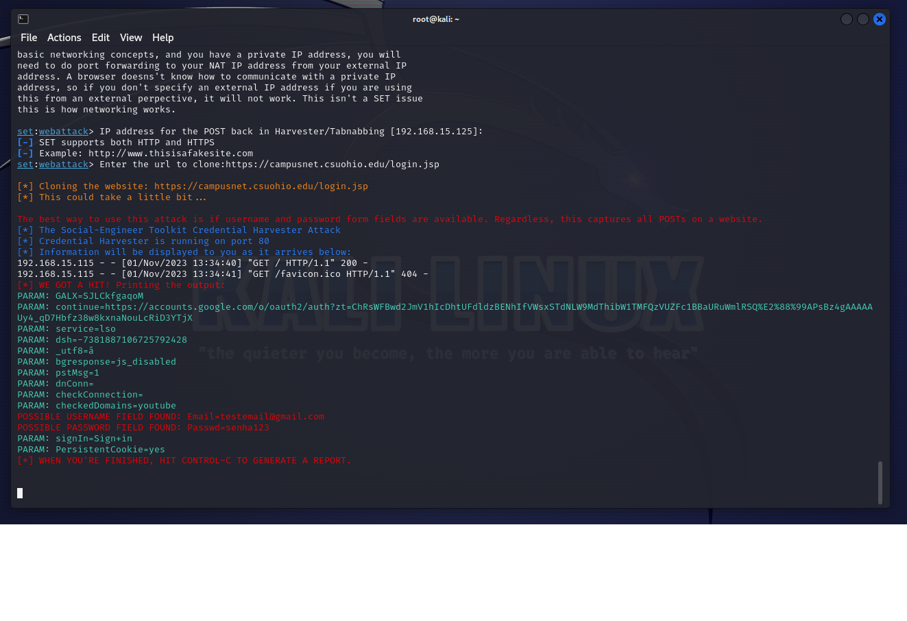

# Phishing to capture passwords

### Tools

- Kali Linux
- setoolkit

### Configuring Phishing on Kali Linux

- Root access: ``` sudo su ```
- Starting setoolkit: ``` setoolkit ```
- Attack type: ``` Social-Engineering Attacks ```
- Attack vector: ``` Web Site Attack Vectors ```
- Attack method: ```Credential Harvester Attack Method ```
- Attack method: ``` Site Cloner ```
- Obtaining the machine address: ``` ifconfig ```
- URL for clone: https://campusnet.csuohio.edu/login.jsp

### Results


